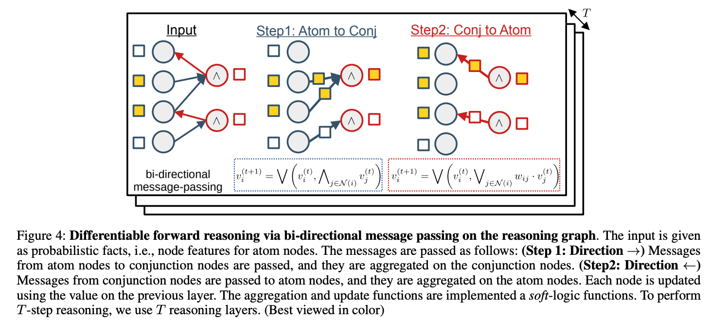

# Neuro-Symbolic Visual Reasoning Behind the Scenes
This is the implementation of Neuro-Symbolic Visual Reasoning Behind the Scenes.

#Abstract
Visual reasoning is an essential function to build an intelligent agent that understands the world 
and performs problem-solving beyond perception. Differentiable reasoning has been developed to 
integrate symbolic reasoning with gradient-based machine learning paradigms. However, most existing
approaches do not scale beyond the observed scene. To overcome this problem, we propose 
Neuro-Symbolic Message-Passing Reasoner (NEUMANN), which is a graph-based approach, 
sending messages in a memory-efficient manner. To evaluate, we propose a new challenging task and
a dataset of visual question answering ``behind the scenes", where the answers are about unobserved 
visual scenes. We empirically demonstrate that NEUMANN solves the proposed task outperforming baselines.

# LICENSE
See [LICENSE](./LICENSE). The [src/yolov5](./src/yolov5) folder is following [GPL3](./src/yolov5/LICENSE) license.