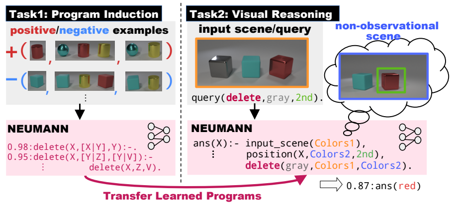

#  Learning Differentiable Logic Programs for Abstract Visual Reasoning
Hikaru Shindo, Viktor Pfanschilling, Devendra Singh Dhami, Kristian Kersting

# Abstract
Visual reasoning is an essential function for building intelligent agents that understand the world and perform problem-solving beyond perception. Differentiable reasoning has been developed to integrate symbolic reasoning with gradient-based machine learning paradigms. However, most existing approaches do not scale for abstract visual reasoning, where the agent needs to perform reasoning by imagining scenes that are not observed. To overcome this problem, we propose NEUro-symbolic Message-pAssiNg reasoNer (NEUMANN), which is a graph-based reasoning approach, passing messages in a memory-efficient manner. NEUMANN can learn abstract operations from observed visual scenes using differentiable forward reasoning, and apply them to new tasks. Since NEUMANN is memory-efficient, it can easily handle complex logic programs for visual scenes. To evaluate, in addition to conventional visual reasoning tasks, we propose a new challenging task and dataset for visual reasoning ``behind the scenes", where the answers are derived by reasoning about unobserved scenes. We empirically demonstrate that NEUMANN solves the proposed task, outperforming baselines.

**NEUMANN solves Behind-the-Scenes task.**
Reasoning behind the scenes:  The goal of this task is to compute the answer of a query, e.g., *``What is the color of the second left-most object after deleting a gray object?''* given a visual scene. To answer this query, the agent needs to reason behind the scenes and understand abstract operations on objects. In the first task, the agent needs to induce an explicit program given visual examples, where each example consists of several visual scenes that describe the input and the output of the operation to be learned. The abstract operations can be described and computed by first-order logic with functors. 
In the second task, the agent needs to apply the learned programs to new situations to solve queries reasoning about non-observational scenes.

# Relevant Repositories
[Visual ILP: A repository of the dataset generation of CLEVR images for abstract operations.](https://github.com/ml-research/visual-ilp)

[Behind-the-Scenes: A repository for the generation of visual scenes and queries for the behind-the-scenes task.](https://github.com/ml-research/behind-the-scenes)

# LICENSE
See [LICENSE](./LICENSE). The [src/yolov5](./src/yolov5) folder is following [GPL3](./src/yolov5/LICENSE) license.